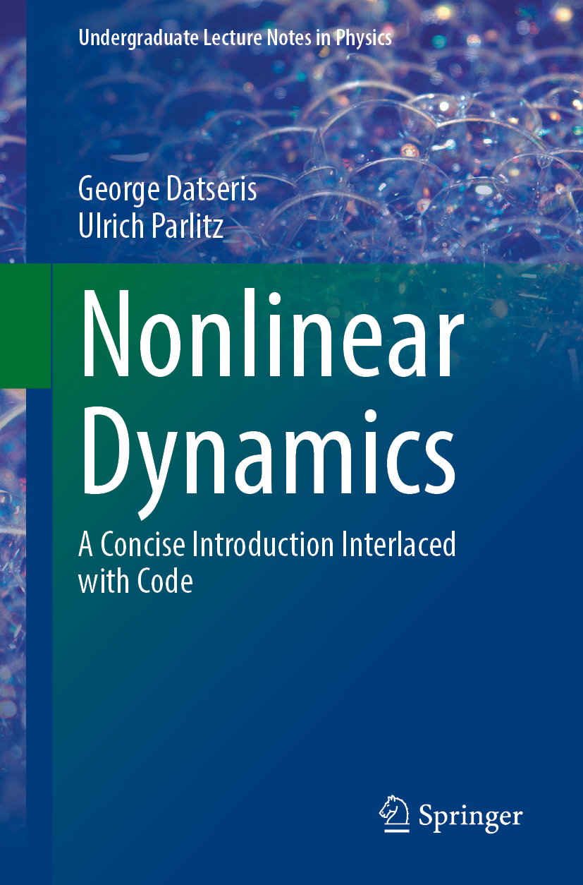

# Nonlinear Dynamics: A concise introduction interlaced with code

> [!IMPORTANT]
> This repository is currently being updated to DynamicalSystems.jl v3
> as well as porting all plotting to the Makie ecosystem.
> To obtain the code exactly corresponding to the first edition of the textbook
> click "Releases" in the right column, and then select "First Edition".
> Download that version of the repository and proceed as explained in the README.md.



This repository holds material related with the textbook _Nonlinear Dynamics: A concise introduction interlaced with code_, co-authored by George Datseris and Ulrich Parlitz. The textbook will be published by Springer-Nature, in the series Undergraduate Lecture Notes in Physics.

> https://link.springer.com/book/10.1007/978-3-030-91032-7


**Please do not open issues to ask questions on installing and running Julia or Julia packages, or questions on nonlinear dynamics in this repository.** Instead, open issues directly related with the book: found typos, problems with the source code contained here, suggestions for improvement of existing book sections, suggestions for new book sections, contributing new exercises, new multiple choice questions, etc. All contributions will be properly acknowledged whenever a new edition is out.

**Contents**
1. [Sample material](#sample-material)
2. [Tutorials for Julia and related packages](#tutorials-for-julia-and-related-packages)
3. [Reproducing figures](#reproducing-figures)
4. [Exercise datasets](#exercise-datasets)
5. [Multiple choice questions](#multiple-choice-questions)
6. [Interactive applications and videos](#interactive-applications-and-videos)

## Sample material
A sample of 10% the book length is contained as `.pdf` in the `sample` folder.

## Tutorials for Julia and related packages
Below we provide links to various sources for learning Julia, or the packages that we use in the code snippets in the book.

- https://www.youtube.com/watch?v=Fi7Pf2NveH0 : Short-timed, intensive Julia workshop, that will teach everything necessary to use Julia. Aimed at people already familiar with programming
- https://www.youtube.com/watch?v=TJqOGsKQti8 : Short-timed introductory video for DynamicalSystems.jl
- https://juliadynamics.github.io/DynamicalSystems.jl/dev/ : Documentation of DynamicalSystems.jl
- https://juliadynamics.github.io/JuliaDynamics/ : Website of the JuliaDynamics organization
- https://www.youtube.com/watch?v=KPEqYtEd-zY : Introduction to solving differential equations in Julia, which is generally useful for nonlinear dynamics
- https://diffeq.sciml.ai/latest/ : Julia differential equations solving library
- https://julialang.org/community/ : Community resources about Julia
- https://discourse.julialang.org/ : Official Julia forum (and also the main platform that newcomers ask questions)
- https://github.com/rveltz/BifurcationKit.jl : Julia software for bifurcation analysis


## Reproducing figures
The accompanying code base used here is using the Julia Language and [DrWatson](https://juliadynamics.github.io/DrWatson.jl/stable/)
to make a reproducible environment that creates the figures of the book.
The code that creates the figures is in the `figure_generation` folder. Notice however that some figures were made with (or enhanced by) PowerPoint and we do not share this here.

To (locally) reproduce a figure, first install Julia and then do the following:

0. Download this repository as-is and export it to some folder.
0. Install `DrWatson` in your general Julia installation by doing:
   ```
   julia> using Pkg; Pkg.add("DrWatson")
   ```
1. Then do:
   ```
   julia> Pkg.activate("path/to/the/downloaded/project/folder")
   julia> Pkg.instantiate() # installs all packages used by the repo
   ```

Now all necessary packages are installed and all scripts should run out of the box.
As you will notice, all scripts start with the commands:
```julia
using DrWatson
@quickactivate "NonlinearDynamicsTextbook"
```
which ensures that only local directories will be used, as well as the *exact* package versions contained within the repository, leading to full reproducibility.
These package versions are also contained in the Project.toml and Manifest.toml files.

## Exercise datasets
The datasets that are used in the book exercises are contained in the `exercise_data` folder, all being in the same text-based format. To load the exercise data you only have to do:
```julia
using DelimitedFiles
n = 3 # for the `n`-th dataset
X = readdlm(projectdir("exercise_data", "$n.csv"))
```

The same folder contains information of where this data is coming from: `data_explanations.md`.

## Multiple choice questions
Multiple choice questions that we use during lecturing to increase student involvement are in the `multiple_choice` folder.

## Interactive applications and videos
In the folder `animations` we provide scripts that launch interactive applications, and also pre-recorded `.mp4` files for convenience.
